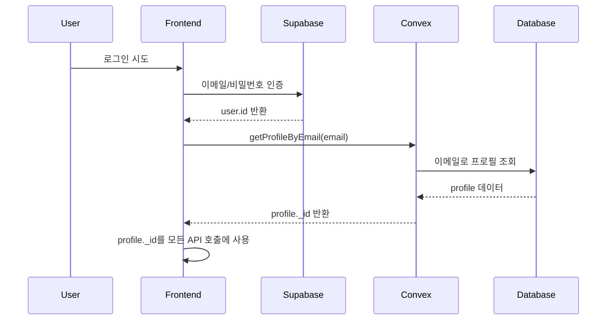

# BIOFOX KOL 인증 구현 가이드

## 목차

1. [개요](#개요)
2. [인증 시스템 아키텍처](#인증-시스템-아키텍처)
3. [핵심 문제와 해결 방안](#핵심-문제와-해결-방안)
4. [구현 패턴](#구현-패턴)
5. [페이지별 구현 예제](#페이지별-구현-예제)
6. [서버 측 구현](#서버-측-구현)
7. [트러블슈팅](#트러블슈팅)
8. [베스트 프랙티스](#베스트-프랙티스)

## 개요

BIOFOX KOL 시스템은 두 가지 인증 시스템을 사용합니다:

- **프론트엔드**: Supabase Auth (이메일/비밀번호 기반)
- **백엔드**: Convex Auth (세션 기반)

이 가이드는 두 시스템 간의 불일치를 해결하고 안정적인 인증 플로우를 구현하는 방법을 설명합니다.

## 인증 시스템 아키텍처

### 1. 인증 플로우 다이어그램



### 2. 핵심 컴포넌트

#### 2.1 useAuth Hook

```typescript
// hooks/useAuth.ts
export function useAuth() {
  const { data: session } = useSession();
  const user = session?.user;

  return {
    user: user
      ? {
          id: user.id,
          email: user.email!,
          // 기타 필드...
        }
      : null,
    isLoading: !session,
    isAuthenticated: !!user,
  };
}
```

#### 2.2 프로필 조회 패턴

```typescript
// 이메일로 프로필 조회
const profile = useQuery(
  api.profiles.getProfileByEmail,
  authUser?.email ? { email: authUser.email } : 'skip'
);
```

## 핵심 문제와 해결 방안

### 문제 1: ID 불일치

- **문제**: Supabase의 `user.id`와 Convex의 `getUserIdentity()`가 다른 값을 반환
- **원인**: 서로 다른 인증 시스템 사용
- **해결**: 이메일을 통한 프로필 조회로 일관된 ID 확보

### 문제 2: 서버 측 인증 실패

- **문제**: `ctx.auth.getUserIdentity()`가 null 반환
- **원인**: Convex가 Supabase 세션을 인식하지 못함
- **해결**: 클라이언트에서 profileId를 파라미터로 전달

### 문제 3: React Hook 무한 루프

- **문제**: 의존성 배열에 함수 포함 시 무한 렌더링
- **원인**: 함수가 매 렌더링마다 재생성
- **해결**: 의존성 배열에서 함수 제거 또는 useCallback 사용

## 구현 패턴

### 1. 페이지 컴포넌트 인증 패턴

```typescript
'use client';

import { useRouter } from 'next/navigation';
import { useEffect } from 'react';
import { useAuth } from '@/hooks/useAuth';
import { useQuery } from 'convex/react';
import { api } from '@/convex/_generated/api';

export default function ProtectedPage() {
  const router = useRouter();
  const { user: authUser, isLoading: authLoading } = useAuth();

  // 이메일로 프로필 조회
  const profile = useQuery(
    api.profiles.getProfileByEmail,
    authUser?.email ? { email: authUser.email } : 'skip'
  );

  // 인증 확인
  useEffect(() => {
    if (!authLoading && !authUser) {
      router.push('/signin');
    }
  }, [authUser, authLoading, router]);

  // 로딩 상태
  if (authLoading || !profile) {
    return <LoadingComponent />;
  }

  // 이제 profile._id를 사용하여 데이터 조회 및 mutation 실행
  return <YourPageContent profileId={profile._id} />;
}
```

### 2. Convex Mutation에 profileId 전달

```typescript
// hooks/useYourFeature.ts
export function useYourFeature({ profileId }: { profileId?: Id<'profiles'> }) {
  const createItem = useMutation(api.yourModule.createItem);

  const handleCreate = useCallback(
    async (data: any) => {
      if (!profileId) {
        throw new Error('프로필 ID가 필요합니다.');
      }

      await createItem({
        ...data,
        profileId, // 프로필 ID 전달
      });
    },
    [createItem, profileId]
  );

  return { handleCreate };
}
```

### 3. Convex 함수에서 profileId 사용

```typescript
// convex/yourModule.ts
export const createItem = mutation({
  args: {
    profileId: v.id('profiles'), // 프로필 ID를 파라미터로 받음
    // 기타 파라미터들...
  },
  handler: async (ctx, args) => {
    // 프로필 확인
    const profile = await ctx.db.get(args.profileId);
    if (!profile) {
      throw new ApiError(ERROR_CODES.NOT_FOUND, 'Profile not found');
    }

    // 이제 profile 정보를 사용하여 작업 수행
    const result = await ctx.db.insert('items', {
      profile_id: args.profileId,
      // 기타 필드들...
    });

    return result;
  },
});
```

## 페이지별 구현 예제

### 1. Customer Manager 페이지

```typescript
// app/kol-new/customer-manager/components/CustomerList.tsx
export default function CustomerList() {
  const { user } = useAuth();
  const kolId = user?.email;

  // 이메일로 프로필 조회
  const profile = useQuery(api.profiles.getProfileByEmail, {
    email: kolId,
  });

  // 프로필 ID로 고객 데이터 조회
  const customers = useQuery(
    api.crm.getCustomersByKol,
    profile ? { profileId: profile._id } : 'skip'
  );

  // mutation에 프로필 ID 전달
  const createCustomer = useMutation(api.crm.createCustomer);

  const handleCreateCustomer = async (data: any) => {
    await createCustomer({
      ...data,
      profileId: profile._id,
    });
  };
}
```

### 2. Clinical Photos 페이지

```typescript
// app/kol-new/clinical-photos/upload/customer/page.tsx
export default function CustomerClinicalUploadPage() {
  const { user: authUser } = useAuth();
  const profile = useQuery(
    api.profiles.getProfileByEmail,
    authUser?.email ? { email: authUser.email } : 'skip'
  );

  // 핸들러에 프로필 ID 전달
  const handlers = useCustomerCaseHandlers({
    // ... 기타 props
    profileId: profile?._id,
  });

  if (!profile) {
    return <LoadingScreen />;
  }

  return <PageContent handlers={handlers} />;
}
```

### 3. Notifications 페이지

```typescript
// app/kol-new/notifications/page.tsx
export default function NotificationsPage() {
  const router = useRouter();
  const { user: authUser, isLoading: authLoading } = useAuth();
  const profile = useQuery(
    api.profiles.getProfileByEmail,
    authUser?.email ? { email: authUser.email } : 'skip'
  );

  // 프로필 ID로 알림 조회
  const notifications = useQuery(
    api.notifications.getUserNotifications,
    profile?._id
      ? {
          profileId: profile._id,
          paginationOpts: { numItems: 20, cursor: null },
        }
      : 'skip'
  );
}
```

## 서버 측 구현

### 1. 프로필 조회 함수

```typescript
// convex/profiles.ts
export const getProfileByEmail = query({
  args: { email: v.string() },
  handler: async (ctx, args) => {
    const profile = await ctx.db
      .query('profiles')
      .withIndex('by_email', q => q.eq('email', args.email))
      .first();

    if (!profile) {
      throw new Error('Profile not found');
    }

    return profile;
  },
});
```

### 2. 인증이 필요한 Mutation

```typescript
// convex/clinical.ts
export const createClinicalCase = mutation({
  args: {
    profileId: v.id('profiles'), // 프로필 ID를 직접 받음
    subject_type: v.union(v.literal('self'), v.literal('customer')),
    // 기타 필드들...
  },
  handler: async (ctx, args) => {
    // 프로필 존재 확인
    const profile = await ctx.db.get(args.profileId);
    if (!profile) {
      throw new ApiError(ERROR_CODES.NOT_FOUND, 'Profile not found');
    }

    // 권한 확인 (필요한 경우)
    if (profile.role !== 'kol' && profile.role !== 'admin') {
      throw new ApiError(ERROR_CODES.FORBIDDEN, 'Insufficient permissions');
    }

    // 케이스 생성
    const caseId = await ctx.db.insert('clinical_cases', {
      profile_id: args.profileId,
      subject_type: args.subject_type,
      // 기타 필드들...
    });

    return caseId;
  },
});
```

### 3. 에러 처리

```typescript
// convex/lib/errors.ts
export class ApiError extends Error {
  constructor(
    public code: string,
    message: string,
    public statusCode: number = 400
  ) {
    super(message);
    this.name = 'ApiError';
  }
}

export const ERROR_CODES = {
  NOT_FOUND: 'NOT_FOUND',
  UNAUTHORIZED: 'UNAUTHORIZED',
  FORBIDDEN: 'FORBIDDEN',
  VALIDATION_ERROR: 'VALIDATION_ERROR',
} as const;
```

## 트러블슈팅

### 1. "User not authenticated or profile not found" 에러

**원인**:

- `ctx.auth.getUserIdentity()`가 null 반환
- Supabase와 Convex 인증 시스템 불일치

**해결방법**:

```typescript
// 잘못된 방법
const currentUser = await getCurrentUser(ctx);
if (!currentUser) {
  throw new Error('User not authenticated');
}

// 올바른 방법
handler: async (ctx, args) => {
  const profile = await ctx.db.get(args.profileId);
  if (!profile) {
    throw new ApiError(ERROR_CODES.NOT_FOUND, 'Profile not found');
  }
  // profile 사용
};
```

### 2. React Error #185 (무한 루프)

**원인**:

- 의존성 배열에 매번 새로 생성되는 함수 포함

**해결방법**:

```typescript
// 잘못된 방법
useEffect(() => {
  // ...
}, [createCase]); // createCase가 매번 재생성됨

// 올바른 방법
useEffect(() => {
  // ...
}, [type, allCases, allCasesLoading, refetchAll, profileId]);
// createCase를 제거
```

### 3. TypeScript 에러: 'profile' is possibly 'null'

**해결방법**:

```typescript
// Optional chaining 사용
profileId: profile?._id,

// 또는 조건부 렌더링
if (!profile) {
  return <LoadingScreen />;
}
```

## 베스트 프랙티스

### 1. 일관된 인증 패턴 사용

모든 페이지에서 동일한 인증 패턴을 사용하세요:

```typescript
const { user: authUser } = useAuth();
const profile = useQuery(
  api.profiles.getProfileByEmail,
  authUser?.email ? { email: authUser.email } : 'skip'
);
```

### 2. 로딩 상태 처리

항상 인증과 프로필 로딩 상태를 모두 확인하세요:

```typescript
if (authLoading || !profile) {
  return <LoadingScreen />;
}
```

### 3. 에러 경계 구현

```typescript
// components/ErrorBoundary.tsx
export class ErrorBoundary extends React.Component {
  componentDidCatch(error: Error) {
    if (error.message.includes('Profile not found')) {
      // 로그인 페이지로 리다이렉트
      window.location.href = '/signin';
    }
  }
}
```

### 4. 타입 안전성 확보

```typescript
// types/auth.ts
import { Id } from '@/convex/_generated/dataModel';

export interface AuthenticatedProps {
  profileId: Id<'profiles'>;
}

// 컴포넌트에서 사용
function YourComponent({ profileId }: AuthenticatedProps) {
  // profileId는 항상 정의되어 있음이 보장됨
}
```

### 5. 재사용 가능한 인증 훅

```typescript
// hooks/useAuthenticatedProfile.ts
export function useAuthenticatedProfile() {
  const router = useRouter();
  const { user: authUser, isLoading: authLoading } = useAuth();
  const profile = useQuery(
    api.profiles.getProfileByEmail,
    authUser?.email ? { email: authUser.email } : 'skip'
  );

  useEffect(() => {
    if (!authLoading && !authUser) {
      router.push('/signin');
    }
  }, [authUser, authLoading, router]);

  return {
    profile,
    isLoading: authLoading || !profile,
    profileId: profile?._id,
  };
}

// 사용 예
export default function YourPage() {
  const { profile, isLoading, profileId } = useAuthenticatedProfile();

  if (isLoading) {
    return <LoadingScreen />;
  }

  // profileId 사용
}
```

## 마이그레이션 가이드

기존 코드를 새로운 인증 패턴으로 마이그레이션하는 단계:

### 1단계: getCurrentUser 제거

```typescript
// Before
const currentUser = await getCurrentUser(ctx);

// After
// args에서 profileId 받기
```

### 2단계: Mutation 수정

```typescript
// Before
export const createItem = mutation({
  args: {
    /* ... */
  },
  handler: async (ctx, args) => {
    const currentUser = await getCurrentUser(ctx);
    // ...
  },
});

// After
export const createItem = mutation({
  args: {
    profileId: v.id('profiles'),
    /* ... */
  },
  handler: async (ctx, args) => {
    const profile = await ctx.db.get(args.profileId);
    // ...
  },
});
```

### 3단계: 프론트엔드 업데이트

```typescript
// Before
await createItem({ data });

// After
await createItem({
  data,
  profileId: profile._id,
});
```

## 결론

이 인증 구현 패턴은 Supabase Auth와 Convex 간의 불일치를 해결하고, 안정적이고 타입 안전한 인증 플로우를 제공합니다. 핵심은 이메일을 통한 프로필 조회와 명시적인 profileId 전달입니다.
