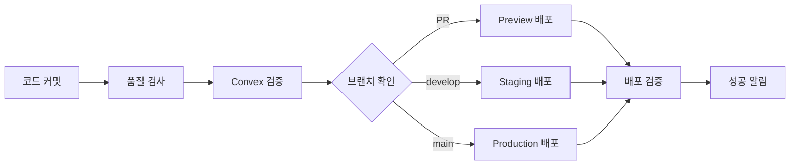

# 🚀 Convex 배포 설정 가이드

이 문서는 Convex 애플리케이션의 배포 파이프라인을 설정하는 방법을 설명합니다.

## 📋 목차

1. [배포 환경 개요](#배포-환경-개요)
2. [필수 준비사항](#필수-준비사항)
3. [GitHub Secrets 설정](#github-secrets-설정)
4. [환경별 배포 설정](#환경별-배포-설정)
5. [배포 스크립트 사용법](#배포-스크립트-사용법)
6. [문제 해결](#문제-해결)

## 🌍 배포 환경 개요

### 지원하는 환경

| 환경            | 설명           | 트리거                | 용도                  |
| --------------- | -------------- | --------------------- | --------------------- |
| **Development** | 로컬 개발 환경 | 수동                  | 개발자 로컬 테스트    |
| **Preview**     | PR 미리보기    | Pull Request          | 코드 리뷰 및 미리보기 |
| **Staging**     | 스테이징 환경  | `develop` 브랜치 push | 통합 테스트           |
| **Production**  | 프로덕션 환경  | `main` 브랜치 push    | 실제 서비스           |

### 배포 파이프라인 플로우



## 🔧 필수 준비사항

### 1. Convex 프로젝트 설정

먼저 각 환경에 대한 Convex 프로젝트를 생성해야 합니다:

```bash
# Convex 대시보드에서 프로젝트 생성
# https://dashboard.convex.dev

# 환경별 프로젝트 권장 명명 규칙:
# - biofox-kol-dev (Development)
# - biofox-kol-preview (Preview)
# - biofox-kol-staging (Staging)
# - biofox-kol-prod (Production)
```

### 2. 배포 키 생성

각 Convex 프로젝트에서 배포 키를 생성합니다:

1. Convex 대시보드 → 프로젝트 선택
2. **Settings** → **Deployment Keys**
3. **Create new key** 클릭
4. 키 이름 입력 (예: `github-actions`)
5. 생성된 키를 안전하게 보관

⚠️ **중요**: 배포 키는 한 번만 표시되므로 반드시 안전한 곳에 저장하세요.

## 🔐 GitHub Secrets 설정

GitHub 리포지토리에서 다음 Secrets을 설정해야 합니다:

### Repository → Settings → Secrets and variables → Actions

#### 필수 Secrets

| Secret 이름                    | 설명                | 예시 값                             |
| ------------------------------ | ------------------- | ----------------------------------- |
| `CONVEX_PRODUCTION_DEPLOY_KEY` | 프로덕션 배포 키    | `prod_1234567890abcdef...`          |
| `CONVEX_URL`                   | 프로덕션 Convex URL | `https://your-prod-id.convex.cloud` |

#### 선택적 Secrets (환경별 배포 시 필요)

| Secret 이름                 | 설명                | 예시 값                                |
| --------------------------- | ------------------- | -------------------------------------- |
| `CONVEX_STAGING_DEPLOY_KEY` | 스테이징 배포 키    | `staging_1234567890abcdef...`          |
| `CONVEX_STAGING_URL`        | 스테이징 Convex URL | `https://your-staging-id.convex.cloud` |
| `CONVEX_PREVIEW_DEPLOY_KEY` | 프리뷰 배포 키      | `preview_1234567890abcdef...`          |

#### 추가 Secrets (필요한 경우)

| Secret 이름                 | 설명               |
| --------------------------- | ------------------ |
| `LHCI_GITHUB_APP_TOKEN`     | Lighthouse CI 토큰 |
| `SUPABASE_SERVICE_ROLE_KEY` | Supabase 서비스 키 |
| `NEXTAUTH_SECRET`           | NextAuth 시크릿    |

### Secrets 설정 방법

1. GitHub 리포지토리 페이지에서 **Settings** 탭 클릭
2. 좌측 메뉴에서 **Secrets and variables** → **Actions** 클릭
3. **New repository secret** 버튼 클릭
4. Secret 이름과 값을 입력하고 **Add secret** 클릭

## 🏗️ 환경별 배포 설정

### Development 환경

개발자 로컬 환경에서 사용:

```bash
# .env.local 파일에 추가
CONVEX_DEV_DEPLOYMENT_KEY=your_dev_deployment_key
CONVEX_DEV_URL=https://your-dev-id.convex.cloud
NODE_ENV=development
```

### Preview 환경

Pull Request 시 자동 배포:

```yaml
# GitHub Actions에서 자동 설정
CONVEX_PREVIEW_DEPLOYMENT_KEY: ${{ secrets.CONVEX_PREVIEW_DEPLOY_KEY }}
```

### Staging 환경

`develop` 브랜치 push 시 자동 배포:

```yaml
# GitHub Actions에서 자동 설정
CONVEX_STAGING_DEPLOYMENT_KEY: ${{ secrets.CONVEX_STAGING_DEPLOY_KEY }}
CONVEX_STAGING_URL: ${{ secrets.CONVEX_STAGING_URL }}
```

### Production 환경

`main` 브랜치 push 시 자동 배포:

```yaml
# GitHub Actions에서 자동 설정
CONVEX_DEPLOYMENT_KEY: ${{ secrets.CONVEX_PRODUCTION_DEPLOY_KEY }}
CONVEX_URL: ${{ secrets.CONVEX_URL }}
NODE_ENV: production
```

## 🎮 배포 스크립트 사용법

### 자동 배포 (GitHub Actions)

브랜치에 코드를 push하면 자동으로 배포됩니다:

```bash
# Preview 배포 (Pull Request 생성)
git checkout -b feature/new-feature
git push origin feature/new-feature

# Staging 배포 (develop 브랜치)
git checkout develop
git push origin develop

# Production 배포 (main 브랜치)
git checkout main
git push origin main
```

### 수동 배포 (로컬)

필요한 경우 로컬에서 직접 배포할 수 있습니다:

```bash
# 프로덕션 배포
npm run deploy

# 환경별 배포
npm run deploy:staging
npm run deploy:preview
npm run deploy:dev

# 드라이런 (실제 배포 없이 테스트)
npm run deploy:dry-run

# 직접 스크립트 실행
node scripts/deploy-convex.js production
node scripts/deploy-convex.js staging --dry-run
node scripts/deploy-convex.js preview --skip-verification
```

### 배포 스크립트 옵션

| 옵션                  | 설명                           | 예시                  |
| --------------------- | ------------------------------ | --------------------- |
| `--dry-run`           | 실제 배포 없이 드라이런만 수행 | `--dry-run`           |
| `--skip-verification` | 배포 검증 건너뛰기             | `--skip-verification` |
| `--force`             | 강제 배포 (백업 없이)          | `--force`             |
| `--help`              | 도움말 표시                    | `--help`              |

## 🔍 배포 검증

각 배포 후 자동으로 다음 검증이 수행됩니다:

### 1. 기본 연결 테스트

- Convex 서버 연결 확인
- 기본 API 응답 테스트

### 2. 핵심 기능 검증

- 대시보드 통계 쿼리
- 사용자 프로필 시스템
- 실시간 기능 동작

### 3. 데이터베이스 무결성

- 스키마 구조 확인
- 테이블 접근 테스트
- 관계 무결성 검증

### 4. 성능 테스트

- 응답 시간 측정
- 메모리 사용량 확인
- 동시 연결 테스트

## ❌ 문제 해결

### 자주 발생하는 문제들

#### 1. 배포 키 오류

```
Error: 🚨 production 환경의 배포 키가 설정되지 않았습니다.
```

**해결방법:**

- GitHub Secrets에서 `CONVEX_PRODUCTION_DEPLOY_KEY` 확인
- Convex 대시보드에서 새 배포 키 생성

#### 2. 환경 변수 누락

```
Error: 필수 환경 변수가 누락되었습니다: CONVEX_URL
```

**해결방법:**

- 필요한 모든 환경 변수가 GitHub Secrets에 설정되어 있는지 확인
- [환경별 배포 설정](#환경별-배포-설정) 섹션 참조

#### 3. Convex CLI 오류

```
Error: Convex CLI가 설치되지 않았습니다.
```

**해결방법:**

```bash
# 로컬에서 Convex CLI 설치
npm install -g convex

# 또는 프로젝트 의존성으로 설치
npm install convex
```

#### 4. 배포 검증 실패

```
Error: 배포 검증 실패: 대시보드 통계 쿼리 타임아웃
```

**해결방법:**

- Convex 함수가 올바르게 배포되었는지 확인
- 네트워크 연결 상태 확인
- `--skip-verification` 옵션으로 임시 배포 가능

#### 5. 권한 오류

```
Error: Insufficient permissions for deployment
```

**해결방법:**

- 배포 키가 올바른 프로젝트용인지 확인
- Convex 대시보드에서 키 권한 확인

### 로그 확인 방법

#### GitHub Actions 로그

1. GitHub 리포지토리 → **Actions** 탭
2. 해당 워크플로우 실행 클릭
3. 실패한 단계의 로그 확인

#### 로컬 배포 로그

```bash
# 상세 로그와 함께 배포
DEBUG=* node scripts/deploy-convex.js production

# 배포 검증만 수행
node scripts/verify-deployment.js
```

### 긴급 롤백

프로덕션 배포가 실패한 경우:

```bash
# 이전 배포로 롤백 (자동)
# 스크립트가 자동으로 백업에서 롤백 시도

# 수동 롤백 (Convex 대시보드)
1. Convex 대시보드 → Deployments
2. 이전 안정 버전 선택
3. "Deploy" 버튼 클릭
```

## 📞 지원

문제가 계속 발생하는 경우:

1. **GitHub Issues**: 버그 리포트 및 기능 요청
2. **Convex 문서**: https://docs.convex.dev
3. **팀 채널**: 내부 개발팀 문의

---

**⚠️ 중요 참고사항:**

- 프로덕션 배포는 반드시 사전 테스트 후 수행하세요
- 배포 키는 절대 코드에 포함하지 마세요
- 정기적으로 백업을 확인하고 복구 절차를 테스트하세요
- 배포 후 모니터링을 통해 시스템 상태를 확인하세요
